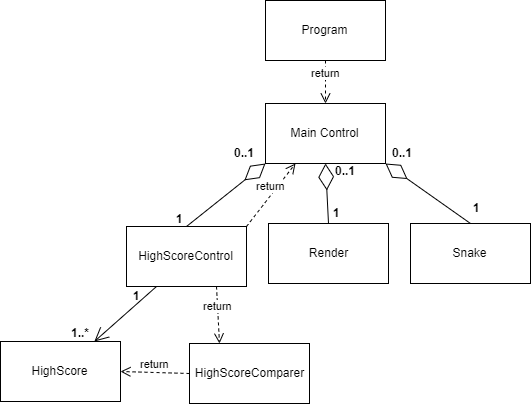
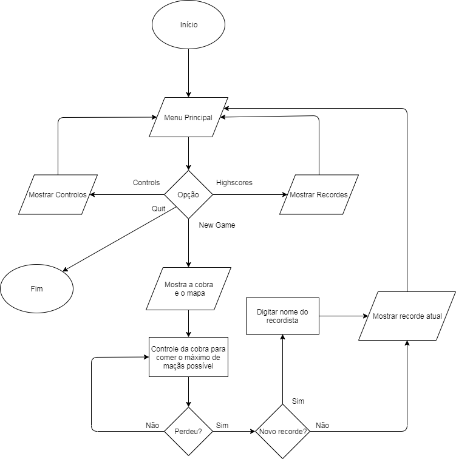

# Relatório do 2º Projeto de Linguagens de Programação II

## Jogo da Cobra (_Snake_)

**Projeto realizado por:**
- [Guilhereme Saturno, a21700118](https://github.com/guisaturno)
- [Lucas Viana, a21805095](https://github.com/LucasViana18)
- [Rita Saraiva, a21807278](https://github.com/RitaSaraiva)

## Indicação do trabalho realizado pelos membros do grupo:

- Guilherme Saturno:
  - Realização do _GameLoop_ do programa;
  - Adicionar corpo á cobra cada vez que esta come uma maçã;
  - Aumentar a velocidade do jogo progressivamente;
  - Realização de parte do relatório, em conjunto com Rita Saraiva e Lucas
  Viana.
  

- Lucas Viana:
  - Criação das classes iniciais do projeto;
  - Criação do mapa e colisão com o mesmo;
  - Implementação de melhorias ao _GameLoop_ do programa;
  - Organização do código, vários _fixes_ e comentários;
  - Realização de parte do relatório, em conjunto com Rita Saraiva e Guilherme
  Saturno.

- Rita Saraiva:
  - Implementação do render da cobra e maçã; 
  - Movimento inicial da cobra;
  - Criação dos _HighScores_ e Menus iniciais;
  - _Doxygen_;
  - Diagrama UML;
  - Realização do relatório, com Lucas Viana e Guilherme Saturno.

## Descrição da solução

### Arquitetura da solução:

No começo foi implementado logo as classes `MainControl`, `Render` e `Snake`
como a principal estrutura de desenvolvimento do jogo _Snake_. Mais tarde, 
foi adicionado um sistema de _score_ para o jogador visualizar os seus 
recordes. 

Este código faz o uso de _design patterns_ tais como 
_Composite pattern_, _Chain of Responsability pattern_, _Command pattern_,
_Mediator pattern_ devido à classe `MainControl` que comanda e chama todas as 
outras classes para correr o programa de uma forma correta e organizada.

Foi muito utilizado o `Console.SetCursorPosition` para definir as posições
de componentes tais como as bordas do mapa e cada parte do corpo da cobra, 
um _switch case_ para os _inputs_ e a classe `Thread` para 
a implementação de _multi-threading_ no programa.

### Diagrama UML:

### Fluxograma

### Referências:

1. Foi utilizada a [API do .NET](https://docs.microsoft.com/en-us/dotnet/api/) e 
[StackOverFlow](https://stackoverflow.com/);
2. Foi utilizado como referência o código aberto deste 
[link](https://codereview.stackexchange.com/questions/127515/first-c-program-snake-game) 
e [video](https://www.youtube.com/watch?v=ONgE5VmvpvM).
3. Para a realização dos _HighScores_ foi reutilizado e alterado código de 
projetos anteriores, mais concretamente do elemento de grupo Rita Saraiva e 
do projeto de segunda época da cadeira de Linguagens de Programação I.
